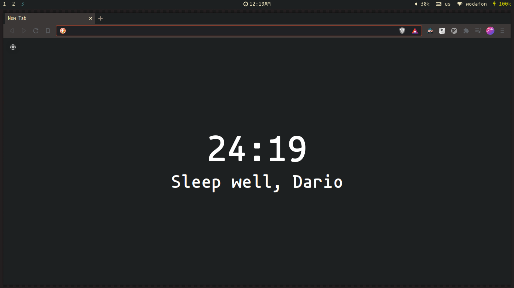
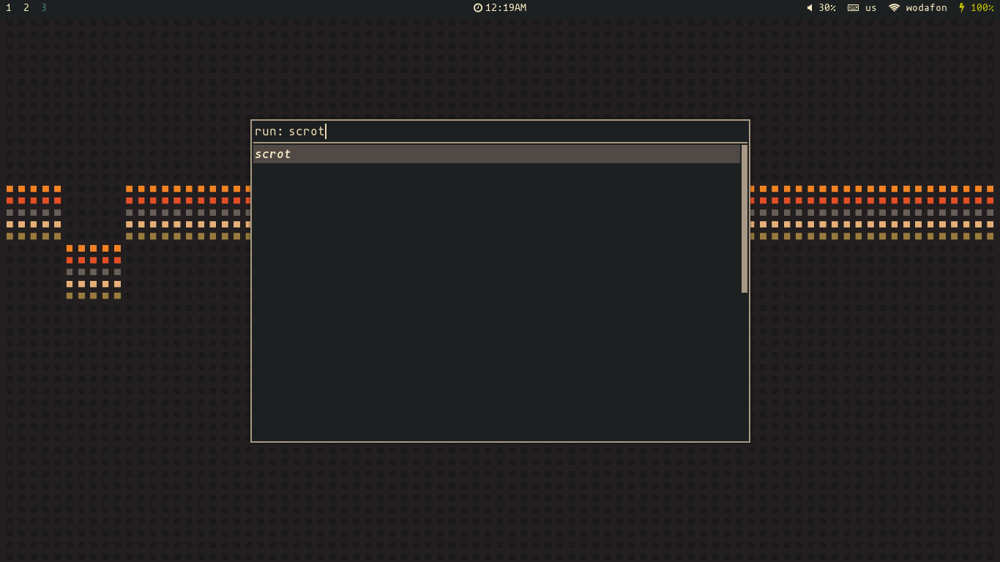
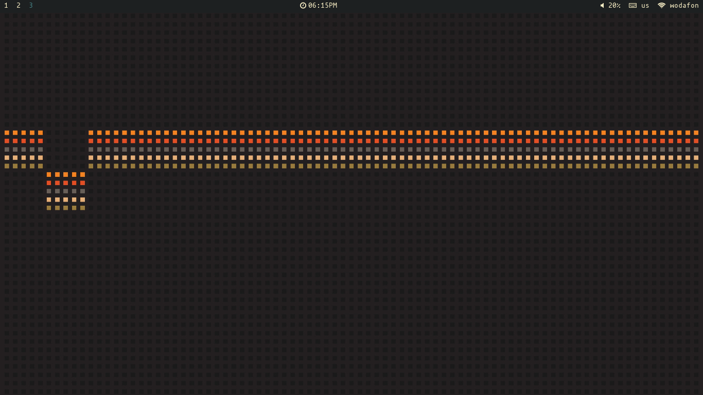
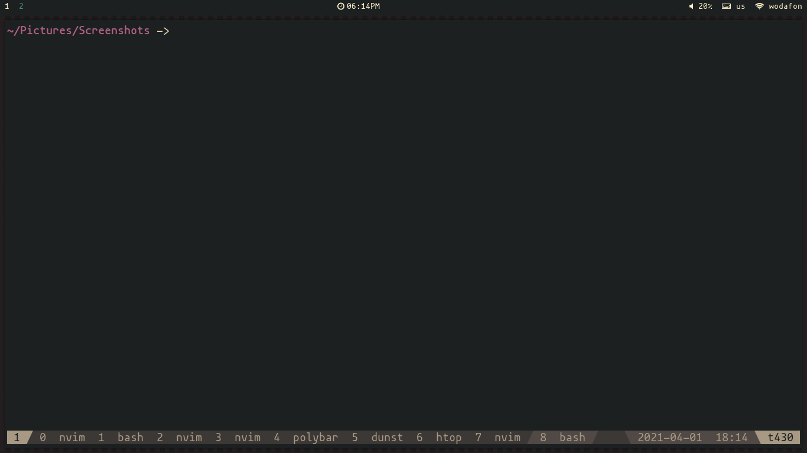

# dotfiles
My personal dotfiles

## Installation
Packages to install:
```sh
git clone http://github.com/darioisthebest/dotfiles
# recommended programs
sudo pacman -S kitty polybar i3-gaps rofi nitrogen picom pfetch lf dunst brave doas
# change theme
. ./switch-theme.sh gruvbox | base16 | nord | onedark
yay -S neovim-git
```

## Screenshots
### Gruvbox




