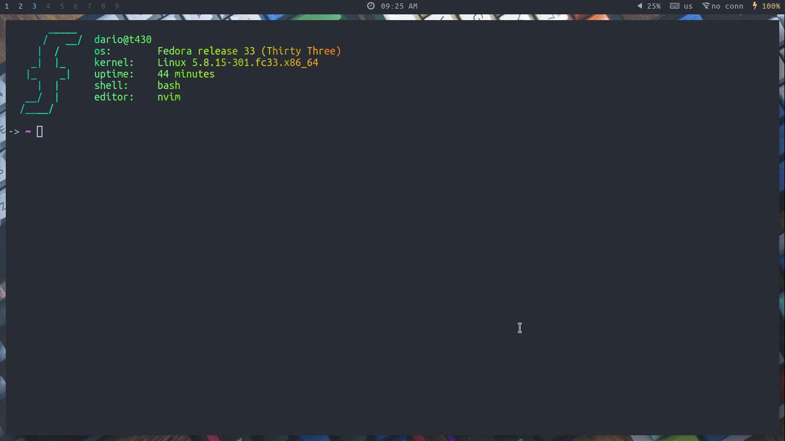

# dotfiles
My personal dotfiles

## Installation
Packages to install:
```sh
git clone http://github.com/darioisthebest/dotfiles
# recommended programs
sudo pacman -S kitty polybar i3-gaps rofi nitrogen picom dunst scrot sxiv
yay -S neovim-git lf pfetch pulseaudio-ctl
```
## Recommended font
Download [here](https://github.com/ryanoasis/nerd-fonts/releases) (nerd fonts)
```sh
# Install mononoki
wget https://github.com/ryanoasis/nerd-fonts/releases/Mononoki.zip
unzip Mononoki.zip
rm -rf *.zip
sudo mv *.ttf /usr/share/fonts
sudo fc-cache -fv
```


## How to change theme
To change theme run the `switch-theme.sh` script and then run the function `switch-theme` with the
theme name, for example:
```sh
. ~/dotfiles/switch-theme.sh
switch-theme THEME_NAME
```
The `THEME_NAME` could be:
 - Nord
 - Onedark
 - Gruvbox
 - Base16

## Screenshots
There are several screenshots available in the `screenshots` folder

### Nord

### Onedark

### Gruvbox

### Base16

