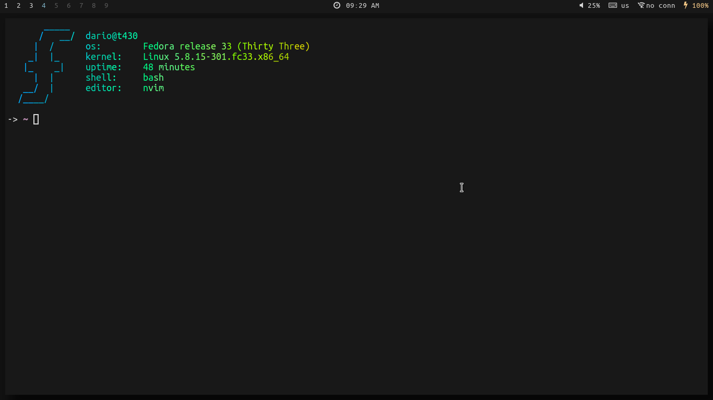

# dotfiles
My personal dotfiles

## Installation
Packages to install:
```sh
git clone http://github.com/darioisthebest/dotfiles
# recommended programs
sudo dnf install alacritty polybar i3-gaps herbstluftwm rofi nitrogen picom dunst maim sxiv firefox
```
## Recommended font
Download [here](https://github.com/ryanoasis/nerd-fonts/releases) (nerd fonts)
```sh
# Install UbuntuMono
wget https://github.com/ryanoasis/nerd-fonts/releases/download/v2.1.0/UbuntuMono.zip
unzip UbuntuMono.zip
rm -rf *.zip
sudo mv *.ttf /usr/share/fonts
sudo fc-cache -fv
```


## How to change theme
To change theme run the `switch-theme.sh` script and then run the function `switch-theme` with the
theme name, for example:
```sh
switch-theme THEME_NAME
```
The `THEME_NAME` could be:
 - Nord
 - Onedark
 - Gruvbox
 - Base16
 - Dark

## Screenshots
There are several screenshots available in the `screenshots` folder

### Nord

### Onedark

### Gruvbox

### Base16

### Dark

## Gtk theme
You need to install lxappearance and the gruvbox-gtk and arc-gtk themes

## Set up firefox
Extensions that I use:
 - uBlock Origin
 - Gruvbox hard/onedark theme
 - Dark reader
